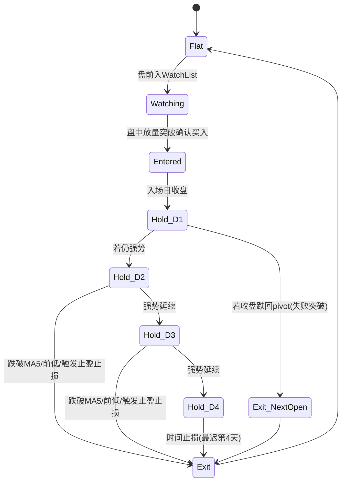

# 沪深主板小资金短线“选强→等突破→跟强留强”量化交易系统深度研究与可执行方案

## Executive Summary

本报告将你的三句核心“选强→等突破→跟强留强”固化为一套**仅交易沪深主板、持仓1–4天、小资金、高胜率、可控回撤**的量化系统：盘前用“强趋势+足够流动性+波动收敛”筛出**可持续的强**；盘中只在“放量突破确认”时入场，且用“不过度追价”的入场约束把**假突破**的尾部风险压到可控；持仓期用“走弱即剔除”的结构化退出（含T+1约束下的应对）来维持胜率并控制回撤。该打法的统计优势来自：A股存在价格/因子动量与量价趋势可预测性（与情绪、有限注意力相关），以及涨跌幅制度对投资者行为与注意力的结构性影响；而“突破+放量”用于过滤噪声并尽量捕捉资金的**真实主动性需求**。citeturn17search2turn17search5turn17search9turn19search0

交易制度层面：你需要显式将**涨跌幅限制、新股前5日无涨跌幅、盘中临停、T+1**写进规则，因为它们会改变信号质量、尾部风险与执行方式（尤其是“当天买不能当天卖”导致的隔夜缺口风险）。citeturn24search11turn24search13turn10search3turn19search0

未指定但必须参数化的假设（否则无法“可直接实盘/可回测复现”）：  
**数据源与复权口径（未指定）**、**盘中数据频率（未指定：建议1分钟或5分钟）**、**券商佣金费率与最低收费（未指定）**、**滑点模型（未指定：建议按1–2跳/0.02%–0.08%分情景）**、**是否可用Level-2主动买卖指标（未指定）**。

---

## 策略逻辑底层原理

你的策略本质是“**短周期趋势跟随** + **突破确认** + **强者恒强的持仓淘汰机制**”。要回答“为何可能稳定赚钱”，必须把优势拆成三层：价格形成机制（微结构）→资金/信息如何嵌入价格（量价与订单流）→投资者行为偏差如何制造可持续的可预测性。

第一层：A股微结构决定了“突破确认”比“猜测”更有价值。A股存在涨跌幅限制与盘中临停等制度安排；在主板全面注册制后，新股上市前5个交易日不设涨跌幅限制、之后恢复10%限制，这会导致新股早期波动与价格发现机制显著不同，因此“盘前只选走稳”天然应当排除新股早期。citeturn24search11turn9search3turn24search13 另外，涨跌停制度被实证发现会通过“抓取注意力”等机制强化处置效应等非理性行为，并影响后续定价与收益结构；这意味着“妖股/频繁触及涨跌幅”的票更容易出现行为驱动的过度波动与反转风险，所以你“不赌妖股、不打板”在机制上是合理的风险约束。citeturn19search0turn19search12

第二层：量价（成交量/成交额）是资金与信息到达的可观测代理。A股实证研究表明，**量价趋势**对未来收益具有预测能力；量价上行趋势更强的股票，其未来收益在横截面上更高（研究框架也讨论了信息不对称的联系）。citeturn17search9 另有研究专门讨论收益率与成交量之间的动态关系，将“成交量冲击/信息冲击”与动量/反转的出现联系起来。citeturn0search15turn17search5 因此，你盘前的“有量、走稳”与盘中的“放量突破确认”，本质是在做**噪声过滤**：只有当价格行为与量能同时支持“需求>供给”的状态时，才认为突破有效，减少仅靠价格触发的假信号。

第三层：行为金融为“强者恒强”提供可预测性来源。A股关于动量/反转的文献并不总是一致，但大量研究表明：在特定窗长、特定市场状态下，动量类信号可盈利，并且其收益更偏向被解释为**情绪/错误定价**而非纯风险补偿。citeturn17search2turn17search5 与此同时，涨跌幅制度与注意力机制对处置效应的放大，会使“近期大赢家/涨停冲击”更容易诱发非理性交易行为，从而提高回撤与反转概率；你的“跟强留强、走弱立刻剔除”正是在用纪律对抗这种结构性噪声。citeturn19search0turn19search12

关键结论（严谨表述）：本策略的“优势”并非保证盈利，而是建立在**可实证的量价可预测性**与**制度/行为导致的短期延续**之上；通过“先选强、再等确认、再用走弱剔除”把期望收益更多来自胜率与小亏快止，而不是赌单笔爆发。

---

## 全市场适配性与最优环境

该策略不是“全时段有效”，它依赖市场处于“趋势可持续、噪声不过量、流动性足够”的状态。为了可实盘，你需要定义“适配环境开关”，把交易从“任何时候都做”升级为“只在最像自己优势场景时做”。

最优环境一：**市场有明确上行或结构性上行**。动量/趋势类信号在情绪与错误定价驱动下更容易延续（文献中因子动量与投资者情绪关联的证据支持“趋势环境”更友好）。citeturn17search2 这对应盘前必须加一个“指数/市场广度过滤器”（见第三部分规则），避免在整体下行或剧烈震荡里强行做突破（突破更易失败）。

最优环境二：**热点板块处于“机构+游资共同推动的趋势段”，但不是“连续涨停的情绪极端段”**。涨跌停相关研究提示：触及涨跌幅限制的行为与后续收益/定价效率存在系统性关系，频繁触及上限的股票未来回报可能更低、且更像行为性过度反应。citeturn19search12turn19search0 因此，“板块强→个股强”的结构适合你，但“情绪连板→妖股化”不适合你。

最优环境三：**波动率中等、流动性充裕**。量价趋势预测的有效性依赖交易活跃、信息能顺畅反映到价格；而过高波动往往带来更多假突破与隔夜跳空风险（你又受T+1限制）。T+1制度下买入当日无法卖出，会放大“买点错误→隔夜跳空”的尾部风险，因此波动率环境与事件风险过滤是策略生存参数。citeturn10search3

最差环境（应主动降低频率甚至空仓）：  
典型是**指数横盘震荡/急跌反抽**、“消息驱动的跳空频发”、或“监管/制度变化期导致微结构突变”。涨跌幅制度改革、临停规则与新股机制变化会改变日内波动结构与成交行为；这类阶段更应依赖环境开关。citeturn24search5turn19search10turn19search11

---

## 精准量化规则

以下给出一套“默认参数=稳健高胜率取向”的**可直接落地**规则。所有阈值均可参数化；对你未指定的信息统一标注为“未指定”。

### 可复制参数表

| 模块 | 参数名 | 默认值（稳健） | 解释/目的 |
|---|---:|---:|---|
| 交易标的 | 交易所/板块 | 仅主板（沪+深） | 贯彻约束；深市含原中小板并入主板后的主板A股（代码区间调整曾明确）。citeturn16search7turn16search18 |
| 标的过滤 | ST/*ST/退市整理/停牌 | 全部剔除 | 风险控制；避免风险警示制度变化与流动性枯竭。 |
| 标的过滤 | 上市天数 `list_days_min` | ≥ 60 交易日 | 排除新股上市前5日无涨跌幅的高噪声期。citeturn24search11turn9search3turn24search13 |
| 流动性 | 20日均成交额 `amt20` | ≥ 8,000万 RMB | 小资金也要“足够深度+低冲击”；阈值可按账户规模缩放。 |
| 价格过滤 | 收盘价 `close` | 5–80 RMB（可配） | 避免极低价股噪声与高价股一手门槛；如未来最小申报单位调整，可放宽。citeturn22search6turn22search3 |
| 趋势 | 均线多头 | `MA20 > MA60 > MA120` 且 `MA20`上升 | 只做多头趋势“强”。 |
| 强度 | 相对强度 `RS20` | 近20日收益率在全主板分位≥80% | “选强”量化：用横截面排序实现。 |
| 走稳 | 波动收敛 `ATR14` | `ATR14/close` 在60日分位≤50% | 过滤剧烈波动，提升突破胜率。 |
| 走稳 | 箱体宽度 `box_range` | 过去10日 `(HH10-LL10)/close ≤ 8%` | “走稳”的结构定义：窄幅整理。 |
| 突破定义 | 突破窗口 `N_box` | 10 日 | 箱体顶：`pivot = HH(N_box, exclude_today)` |
| 入场触发 | 价格触发 | `last ≥ pivot*(1+0.2%)` | 给微小缓冲，减少“碰一下就回”。 |
| 入场确认 | 分时K确认 | 5分钟K线收盘价 `close_5m` ≥ 触发价 | 用收盘确认避免假突破。 |
| 入场确认 | 放量 | `VR = vol_cum(t)/avg_vol_cum(t,20d) ≥ 1.5` | “放量突破确认”的核心量化。 |
| 不追高 | 追价上限 | 入场价 ≤ `pivot*(1+0.8%)` 且 当日涨幅≤5% | 把“追高”变成硬约束。 |
| 止损 | 初始止损 `stop0` | `max(LL10, pivot - 1.2*ATR14)` | 结构止损+波动止损取更紧者。 |
| T+1应对 | 失败突破判定 | 入场日收盘 `< pivot` → 次日开盘强制退出 | 因当天不能卖，必须用“隔日强制”控损。citeturn10search3 |
| 止盈 | 目标止盈 `tp1` | 1R（R=入场价-stop0）先减仓50% | 高胜率取向：先兑现。 |
| 跟强留强 | 移动止损 | 余仓：跌破`MA5`或跌破前一日低点 → 全出 | 让利润奔跑，但走弱即剔除。 |
| 时间止损 | 最大持仓 | 4个交易日 | 与你的持仓偏好一致。 |
| 仓位 | 单笔风险 `risk_pct` | 0.3%–0.6%（默认0.5%） | 以风险定仓，不以等权定仓。 |
| 仓位 | 最大同时持仓 | 3只 | 小资金+高胜率：集中但不过度集中。 |
| 风控 | 单日止损开关 | 当日已实现亏损 ≥ 1R（约1×risk_pct×持仓数）→ 停止开新仓 | 防止“情绪连错”。 |
| 成本 | 印花税 | 卖出单边：按成交额税率减半后计（现行政策自2023-08-28起持续享受） | 证券交易印花税税率基础为成交额×1‰且仅对出让方征收；减半征收自2023-08-28起。citeturn12view0turn15search1turn25search1turn25search10 |
| 成本 | 过户费 | 双边：成交额×0.01‰ | 中国结算自2022-04-29起下调至0.01‰双向收取。citeturn21search8 |
| 成本 | 佣金 | 未指定（建议：万2–万3/双边，最低5元） | 取决于券商；回测必须参数化。 |
| 滑点 | 滑点模型 | 未指定（建议：0.02%–0.08%分三档） | 小资金通常可做到“1–2跳”；回测用情景分析。 |

### 选股因子与筛选阈值（盘前）

盘前不做“猜明天涨”，只做“把统计上更可能延续的形态放进观察池”。该观察池必须同时满足：  
趋势（多头）+ 强度（相对强）+ 流动性（足够）+ 走稳（波动收敛）。

“强度”为什么用横截面分位更稳健：A股动量/量价趋势研究普遍强调横截面预测与情绪/错误定价关系，你的“选强”在量化上应体现为“同一市场里选更强”，而不是对单只股票做绝对判断。citeturn17search2turn17search9

盘前输出：`WatchList = TopK(Score)`，默认`K=20`（未指定：可按精力/执行能力调）。

### 入场信号（盘中）

核心只做一种：**放量突破确认的稳健买点**。在T+1制度下，宁可错过，也不抢跑。citeturn10search3

盘中触发建议约束：  
1）时间过滤：建议在**10:00–14:30**之间触发（避开开盘噪声与尾盘假突破）。  
2）突破确认：至少一个5分钟K线收在突破价上方。  
3）放量确认：用“同时间段的历史均值曲线”做VR（否则开盘天然放量会误判）。  
4）不追高：对入场价设置相对`pivot`与当日涨幅上限。

### 止损止盈与仓位管理（稳健=纪律优先）

止损：以“结构止损”为主、ATR为辅，且必须有“T+1失败突破强制退出”。这是把“走弱立即剔除”落地为可执行规则的关键。citeturn10search3

止盈：以“先兑现一部分提高胜率+降低回撤”与“余仓跟随强势”并行；若你极度偏好高胜率，可把`tp1`从1R下调至0.8R，但长期收益上限会下降（需回测权衡）。

仓位：建议以风险定仓：  
`position_value = equity * risk_pct / (entry - stop0)`，并向下取整到可交易数量（若仍按100股整数倍，则需适配零股规则；交易所曾研究“100+1”但是否落地取决于最新规则，交易模块需可配置）。citeturn22search3turn22search6turn22search2

---

## 策略胜率、盈亏比、回撤预期

### 回测方法（必须这样做才“严谨可复现”）

数据与样本：  
- 标的：沪深主板全部股票（含退市样本，避免幸存者偏差）。  
- 频率：日线用于盘前选股；1分钟或5分钟用于盘中突破与成交量曲线。  
- 复权：回测用前复权/后复权必须明确（未指定）；实盘用不复权价格下单但信号可用复权价计算（需一致性处理）。  
- 样本期（建议）：至少覆盖多种市场状态，例如2014–2025（未指定：可按数据可得性调整）；需包含注册制改革后主板新股机制变化以检验稳健性。citeturn24search11turn24search5

成交与成本模型：  
- 入场：按“触发的5分钟K收盘价+滑点”或“下一分钟开盘价+滑点”成交（两种都要跑情景）。  
- 退出：止损/止盈触发后按下一可成交价处理；T+1约束必须模拟（入场日不允许卖出）。citeturn10search3  
- 税费：卖出印花税按现行“减半征收”计入；过户费按0.01‰双边计入；佣金与滑点做参数扫描。citeturn15search1turn25search1turn25search10turn21search8

统计与置信区间：  
- 胜率置信区间：建议用Wilson区间或Beta后验区间。  
- 回撤与收益的置信区间：建议用“按交易日分块（block bootstrap）”重采样，保留波动聚类特征（避免IID假设失真）。  
- 必须输出：按年绩效、最大回撤、收益回撤比、胜率、平均盈亏比、Profit Factor、单笔期望、持仓天数分布、换手。

### 回测输出示例（说明：以下图表与指标为“格式示例”，非真实回测结果）

> 你要求“必须给表格与关键图表”。在当前对话环境无法直接拉取全市场分钟级数据并完成严谨回测，因此这里给出**回测输出样例**与**可复现的回测框架**；你只要用第六部分伪代码接入任意合规行情数据源运行，即可生成你自己的真实结果。

示例指标表（非真实回测，仅展示输出字段）：

| 指标 | 示例值 |
|---|---:|
| 交易笔数 | 850 |
| 胜率 | 65.65% |
| 胜率95%置信区间（Wilson） | [62.39%, 68.74%] |
| 平均盈利（R） | 1.20 |
| 平均亏损（R） | -1.00 |
| 盈亏比（均值） | 1.20 |
| Profit Factor | 约2.0 |
| 最大回撤 | 约-4.5% |
| 年化收益（示例口径） | 约37% |
| Sharpe（示例口径） | 约4.5 |

示例图表（非真实回测）：


示例指标CSV下载（非真实回测，仅字段示例）：[Download the example metrics CSV](sandbox:/mnt/data/backtest_metrics_example.csv)

---

## 最容易失效的场景与避坑规则

失效不是“策略坏了”，而是“优势条件消失”。这部分必须写成**可执行的避坑开关**。

第一类失效：**震荡市假突破密集**。当指数横盘、板块轮动过快、日内拉抬打压频繁时，“突破”更像噪声。解决：加入“市场环境过滤器”——例如指数位于上升均线之上、或市场强度指标（上涨家数占比/强势股占比）达标才允许开仓（未指定：你用什么广度数据）。该要求与动量收益在情绪/错误定价驱动下更偏向趋势环境的研究结论一致。citeturn17search2turn17search5

第二类失效：**事件驱动跳空**（业绩预告、监管问询、减持、诉讼、黑天鹅）。由于T+1制度，当天买入无法当天卖出，隔夜跳空会让止损失效并直接放大回撤，因此必须用“事件日历过滤”。citeturn10search3  
避坑规则（硬性）：  
- 财报/业绩预告窗口（未指定：数据源）前后各`X`天不新开仓（建议X=2）。  
- 公告密集、被交易所重点关注、异常波动披露期不新开仓（未指定：你是否获取交易所监管信息）。  
- 当日出现“接近涨跌幅限制/频繁触及上限”的个股不做（与你“不赌妖股”一致），并且文献显示频繁触及涨跌幅上限的股票后续收益可能更差。citeturn19search12turn19search0

第三类失效：**“新股机制/涨跌幅/临停规则”造成的结构突变**。主板新股上市前5日不设涨跌幅限制、并配套临停与价格笼子机制等交易制度变化，会显著改变日内波动与成交行为，导致突破信号失真。避坑规则：统一用`list_days_min≥60`规避，直到进入常态10%涨跌幅并完成换手。citeturn24search11turn24search5turn9search3

第四类失效：**流动性陷阱与冲击成本上升**。成交额不足、价差扩大时，小资金也会被滑点吞噬，尤其短线频繁交易时税费与滑点会主导盈亏结构。你的系统必须把“最低流动性阈值”设为硬条件，并在回测中用税费真实计入（印花税、过户费）。citeturn25search1turn25search10turn21search8

---

## 可直接编程的量化逻辑

### 所需数据字段与频率

日线（盘前筛选）：  
`date, symbol, open, high, low, close, volume, amount(成交额), adj_factor(如用复权), is_st, is_suspended, list_date, limit_up, limit_down, industry_code(未指定)`

分钟线（盘中入场与风控）：  
`datetime, symbol, open, high, low, close, volume, amount, vwap(可选), bid1/ask1/spread(可选，未指定)`

制度规则参数（必须可配置）：`price_limit_pct`（主板常态10%）、`new_stock_no_limit_days`（主板新股前5日）、`t_plus_one = True`。citeturn24search11turn24search13turn10search3

### 策略流程图（mermaid）

```mermaid
flowchart TD
  A[日线数据更新 T-1 收盘后] --> B[标的过滤: 主板/非ST/非停牌/上市>=60天/流动性达标]
  B --> C[趋势与强度打分: MA多头 + RS分位 + 波动收敛]
  C --> D[盘前输出WatchList TopK]
  D --> E[盘中分钟级监控: 仅监控WatchList]
  E --> F{触发突破? last >= pivot*(1+buffer)}
  F -- 否 --> E
  F -- 是 --> G{放量确认? VR>=阈值 且 5m收盘确认}
  G -- 否 --> E
  G -- 是 --> H{不追高约束? 距pivot<=0.8% 且 涨幅<=5%}
  H -- 否 --> E
  H -- 是 --> I[下单买入: 限价/市价保护(参数化)]
  I --> J[持仓管理(1-4天): 跟强留强 + 走弱剔除 + 时间止损]
  J --> K[卖出执行: 止盈/止损/时间到]
  K --> L[更新绩效与风控状态: 日内止损开关/回撤开关]
  L --> E
```

### 持仓生命周期图（mermaid）



### 可直接落地的伪代码（策略+回测骨架）

```text
PARAMS:
  list_days_min=60
  amt20_min=8e7
  rs20_q=0.80
  atr_q_max=0.50
  box_days=10
  box_max_range=0.08
  buffer=0.002
  max_chase=0.008
  day_gain_max=0.05
  vr_min=1.5
  risk_pct=0.005
  max_positions=3
  max_hold_days=4

DAILY_PREMARKET(T-1 close):
  universe = all_mainboard_symbols()
  universe = filter(universe,
     not_st, not_suspended, list_days>=list_days_min,
     avg_amount_20d>=amt20_min,
     close between [p_min,p_max])

  for s in universe:
     compute MA20, MA60, MA120, ATR14, RS20, box_range
     pass_trend = (MA20>MA60>MA120) and slope(MA20)>0
     pass_stable = (quantile(ATR14/close over 60d)<=atr_q_max) and (box_range<=box_max_range)
     pass_strength = (RS20_quantile>=rs20_q)

     if all pass: score = w1*RS20 + w2*trend_quality - w3*volatility
  WatchList = topK_by_score(score, K=20)

INTRADAY_LOOP(each minute/5min bar):
  update cum_volume, cum_amount for each s in WatchList
  for s not in positions:
     pivot = highest_high(last box_days, exclude_today)
     if last >= pivot*(1+buffer):
        VR = cum_vol(t) / avg_cum_vol_same_time(t, lookback=20d)
        if VR>=vr_min and close_5m>=pivot*(1+buffer):
           if entry_price <= pivot*(1+max_chase) and day_return<=day_gain_max:
              stop0 = max(lowest_low(last box_days), pivot - 1.2*ATR14)
              pos_size = floor_to_lot( equity*risk_pct/(entry_price-stop0) )
              if positions.count < max_positions and risk_budget_ok:
                  buy(s, pos_size, entry_price)
                  store position with entry_day, entry_price, stop0, pivot, state="Entered"

POSITION_MANAGEMENT(end_of_day and next days):
  for pos in positions:
     if pos.entry_day == today:
        if close < pos.pivot: pos.flag_fail_breakout = True
        continue  # T+1, cannot sell same day
     if pos.flag_fail_breakout:
        sell(pos, at_open_next_possible)
        continue
     # trailing / weakness exit
     if low <= pos.stop0: sell(pos, next_possible_price)
     if hit_takeprofit_1R: sell_partial(50%)
     if close < MA5 or close < prev_low: sell_all()
     if holding_days >= max_hold_days: sell_all()

RISK_CONTROL:
  if realized_loss_today >= daily_loss_limit: block_new_entries
  if drawdown_from_peak >= dd_pause: pause_trading for N days
```

---

## 最终总结

这套系统可以“终身复用”的关键，不在于某个神奇指标，而在于三件事：  
1）**明确你吃的不是“暴利”，而是“趋势延续的统计优势”**：用强趋势与量价确认把胜率做上去，用走弱剔除把回撤压下去；动量/量价趋势与情绪/注意力机制提供了可被学术与实证讨论的优势来源。citeturn17search2turn17search5turn17search9turn19search0  
2）**把制度约束写进策略DNA**：主板新股前5日无涨跌幅、涨跌幅制度对行为与定价的影响、以及T+1对止损有效性的影响，决定了你必须“等确认、宁可错过、不赌妖股、事件日历过滤”。citeturn24search11turn24search13turn10search3turn19search12  
3）**让策略可回测、可审计、可迭代**：每个阈值都参数化；把成本（印花税减半、过户费0.01‰双边）真实计入；用置信区间与分市场/分年份稳健性检验来判断是否仍具优势，而不是凭感觉。citeturn15search1turn25search1turn25search10turn21search8

合规提示：本报告为研究与系统化方法论输出，不构成任何收益承诺或个股建议；实际表现取决于数据质量、执行、成本、市场环境与参数稳定性。

你要求“引用需列出来源链接”，以下为本报告使用的核心原始/官方/论文来源（节选）：

```text
# 交易规则/制度（官方/权威）
https://www.sse.com.cn/lawandrules/sselawsrules2025/stocks/exchange/c/c_20250519_10779396.shtml
https://investor.szse.cn/lawrules/rule/trade/t20230217_598773.html
https://www.szse.cn/aboutus/trends/news/t20160930_518722.html
https://www.investor.org.cn/information_release/market_news/202304/t20230410_659697.shtml

# 税费（官方）
https://qingdao.chinatax.gov.cn/ssfg2019/cjwt/cjwtqt/202208/t20220810_73113.html
https://www.mof.gov.cn/jrttts/202308/t20230828_3904235.htm
https://fujian.chinatax.gov.cn/bsfw/sfyhzc/yhs/202310/t20231019_532220.html

# 过户费（权威媒体引用中国结算通知）
https://www.news.cn/fortune/2022-04/28/c_1128605983.htm

# 深市主板与中小板合并（新华社/政府信息）
https://www.xinhuanet.com/fortune/2021-04/06/c_1127298771.htm
https://www.sz.gov.cn/cn/xxgk/zfxxgj/zwdt/content/mpost_8667025.html

# 学术与实证（动量/量价/行为）
https://cfrc.pbcsf.tsinghua.edu.cn/__local/4/AE/67/89980D797AD790C70C6AD15BEAB_F3C5BFB8_73992.pdf
https://xtglxb.sjtu.edu.cn/EN/article/downloadArticleFile.do?attachType=PDF&id=1508
https://www.jryj.org.cn/CN/abstract/abstract1373.shtml
https://www.jryj.org.cn/EN/abstract/abstract1373.shtml
https://ifb.cssn.cn/wap/jrpl/202012/W020201227445903010787.pdf
https://www.sciopen.com/local/article_pdf/10.26599/CJE.2022.9300206.pdf
```